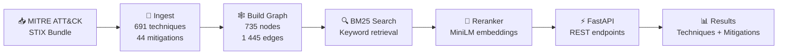

# 🛡️ ATT&CK Ground Segment Threat Graph

[](https://github.com/thierrymaesen/attack-gseg/actions/workflows/ci.yml)
[](https://opensource.org/licenses/MIT)
[](https://www.python.org/downloads/)
[](https://github.com/psf/black)
[](https://colab.research.google.com/github/thierrymaesen/attack-gseg/blob/main/demo.ipynb)

> An AI-powered security tool that maps ground segment logs to MITRE ATT&CK techniques using semantic search and knowledge graphs. Designed for space operations centers (SOC).

### 🤖 AI Domain & Approach

This project belongs to the field of **Natural Language Processing (NLP)** applied to **cybersecurity threat intelligence**. It implements a **hybrid retrieval-augmented pipeline** that combines classical information retrieval with modern deep learning techniques:

- **Information Retrieval (BM25)** — A probabilistic keyword-based search algorithm (Okapi BM25) indexes all 691 ATT&CK technique descriptions and performs fast lexical matching against security event queries.
- **Semantic Search (Sentence Embeddings)** — A pre-trained transformer model (`all-MiniLM-L6-v2` from Hugging Face / sentence-transformers) encodes both the query and candidate techniques into dense vector representations (384-dimensional embeddings), then reranks results by cosine similarity to capture meaning beyond exact keyword matches.
- **Knowledge Graph Reasoning (NetworkX)** — A directed graph models the structured relationships between ATT&CK techniques and mitigations (735 nodes, 1 445 edges), enabling the system to traverse links and recommend defensive measures for each identified threat.

The AI approach is **retrieval + reranking** (sometimes called a *two-stage retrieval pipeline*): BM25 retrieves a broad set of keyword-relevant candidates, then the neural reranker refines the ranking using semantic understanding. This architecture does not use generative AI (no LLM generates text); instead, it relies on **discriminative NLP models** for similarity scoring and a **structured knowledge graph** for relationship navigation.

### 📋 What the Program Can Do Today

ATT&CK Ground Segment Threat Graph is a fully operational security analysis tool that enables analysts to:

- **Map any security event to MITRE ATT&CK techniques** — Describe an incident in plain language (e.g., *"Unauthorized SSH access from unknown IP attempting lateral movement"*) and the system identifies the most relevant ATT&CK techniques ranked by confidence score.
- **Get actionable mitigation recommendations** — For each identified technique, the knowledge graph provides the officially documented MITRE mitigations with direct links to the ATT&CK website.
- **Query via REST API or web interface** — Use the FastAPI endpoints (`/map_event`, `/techniques`, `/health`) for programmatic integration, or the interactive Gradio UI for manual analysis and triage.
- **Analyze events in near real-time** — The full pipeline (BM25 retrieval + semantic reranking + graph traversal) completes in approximately 200 ms, making it suitable for real-time security operations workflows.
- **Cover the full ATT&CK Enterprise matrix** — The system indexes 691 techniques (216 base + 475 sub-techniques) and 44 mitigations from the official MITRE ATT&CK STIX data, ensuring comprehensive threat coverage.


**Author:** [Thierry Maesen](https://github.com/thierrymaesen)
**Repository:** [github.com/thierrymaesen/attack-gseg](https://github.com/thierrymaesen/attack-gseg)

---

## 🎬 Demo — Pipeline in Action

Click the **Open in Colab** badge above to run the full pipeline interactively — no install required. Below is a walkthrough of each stage with real output.

### Pipeline Overview



### Step 1 — Ingest ATT&CK STIX Data

The pipeline downloads the official [MITRE ATT&CK Enterprise STIX bundle](https://github.com/mitre/cti) (43 MB) and parses it into structured JSON files. The counts match the official MITRE ATT&CK database exactly: **691 techniques** (216 + 475 sub-techniques), **44 mitigations**, and **1 445 relationships**.


### Step 2 — Build Knowledge Graph

A directed NetworkX graph is constructed with **735 nodes** (691 techniques + 44 mitigations) and **1 445 edges** (mitigation→technique relationships). The statistics reveal that `defense-evasion` is the most represented tactic (215 techniques), and 84.2% of techniques have at least one documented mitigation.


### Step 3 — BM25 Keyword Retrieval

A BM25 index over technique descriptions enables fast keyword search. For the query `"SSH lateral movement"`, the engine correctly returns **T1570 — Lateral Tool Transfer** as the top match, followed by SSH-related techniques and their mitigations.


### Step 4 — Semantic Reranking

BM25 candidates are reranked using `all-MiniLM-L6-v2` sentence embeddings for semantic relevance. For `"process injection to evade detection"`, the reranker places **T1055 — Process Injection** at #1 (score 0.5990) and promotes T1564.011 from BM25 rank 17 to rank 2, demonstrating the value of semantic understanding over pure keyword matching.


### Step 5 — FastAPI + Live Query

The FastAPI server exposes `/map_event`, `/techniques`, and `/health` endpoints. A query for `"phishing email with malicious attachment"` returns **T1566 — Phishing** as the top result with its official MITRE mitigations (Antivirus/Antimalware, Audit, Network Intrusion Prevention) — all verified against the [MITRE ATT&CK website](https://attack.mitre.org/techniques/T1566/).


---

## ✨ Features

- 🧠 **Semantic Search** — Combines BM25 retrieval with `all-MiniLM-L6-v2` sentence embeddings for context-aware technique detection.
- 🕸️ **Knowledge Graph** — Navigates relationships between ATT&CK Techniques and Mitigations via a directed NetworkX graph.
- ⚡ **FastAPI Backend** — High-performance REST API with automatic Swagger/OpenAPI documentation.
- 🖥️ **Gradio UI** — Interactive web interface for security analysts to triage events in real time.
- 🏗️ **Production-Ready** — Fully tested (pytest + coverage), linted (Ruff), formatted (Black), and CI/CD integrated (GitHub Actions).

---

## 🚀 Quickstart

### Prerequisites

- **Python 3.10+** — [Download](https://www.python.org/downloads/)
- **Poetry** (recommended) — [Install Poetry](https://python-poetry.org/docs/#installation)

> **No Poetry?** You can use `pip` instead — see the **pip** alternative in each step below.

### 1. Clone & Install

**With Poetry (recommended):**

```bash
git clone https://github.com/thierrymaesen/attack-gseg.git
cd attack-gseg
poetry install
```

**With pip:**

```bash
git clone https://github.com/thierrymaesen/attack-gseg.git
cd attack-gseg
pip install -e .
```

### 2. Ingest ATT&CK Data (first run only)

**With Poetry:**

```bash
# Download MITRE ATT&CK STIX bundle and build the knowledge graph
poetry run python -m gseg.ingest_attack
poetry run python -m gseg.build_graph
```

**With pip:**

```bash
# Download MITRE ATT&CK STIX bundle and build the knowledge graph
python -m gseg.ingest_attack
python -m gseg.build_graph
```

### 3. Run the Application

**With Poetry:**

```bash
# Terminal 1 — Start the API server
poetry run uvicorn gseg.api:app --reload

# Terminal 2 — Start the Gradio UI
poetry run python app/gradio_app.py
```

**With pip:**

```bash
# Terminal 1 — Start the API server
uvicorn gseg.api:app --reload

# Terminal 2 — Start the Gradio UI
python app/gradio_app.py
```

The API is available at **http://localhost:8000** and the Gradio UI at **http://localhost:7860**.

### 🖥️ Local Usage Guide — Step by Step

Once both servers are running, here is how to use the application locally on your computer.

#### Step 1 — Verify the API is running

Open your browser and navigate to `http://localhost:8000/health`. You should see the following JSON response confirming the API is operational and all models are loaded:


> **Note:** If you visit `http://localhost:8000` directly, you will see `{"detail":"Not Found"}` — this is **normal**. The API has no homepage; it only responds on its specific endpoints (`/health`, `/map_event`, `/techniques`).
>
> #### Step 2 — Explore the API documentation (Swagger UI)
>
> Navigate to `http://localhost:8000/docs` to access the interactive Swagger documentation. Here you can see all available endpoints, test them directly from the browser, and inspect request/response schemas:
>
> 
>
> The API exposes three endpoints: `GET /health` (service health check), `POST /map_event` (map a security event to ATT&CK techniques), and `GET /techniques` (list all indexed techniques).
>
> #### Step 3 — Open the Gradio interface
>
> Navigate to `http://localhost:7860` in your browser. The Gradio web interface loads with a text area where you can describe a security event, a slider to choose how many results to display (Top K), and a checkbox to include mitigations:
>
> 
>
> #### Step 4 — Enter a security event description
>
> Type or paste a security event description in the text area. For example: *"Unauthorized SSH access from unknown IP attempting lateral movement to ground station controller"*. Adjust the **Top K Results** slider if needed (default is 3), then click the **Analyze Threat** button:
>
> 
>
> #### Step 5 — Review the analysis results
>
> After clicking **Analyze Threat**, the system returns the top matching MITRE ATT&CK techniques ranked by relevance. Each result includes the technique ID (linked to MITRE), the technique name, BM25 and rerank scores, associated tactics, and recommended mitigations:
>
> 
>
> Scroll down to see additional matching techniques. In this example, the system identified three relevant techniques: **T1563.001 — SSH Hijacking**, **T1021.004 — SSH**, and **T1098.004 — SSH Authorized Keys**, each with their associated tactics and mitigations:
>
> 
>
> > **Tip:** Click on any technique ID (e.g., T1563.001) or mitigation ID (e.g., M1042) to open the corresponding page on the official MITRE ATT&CK website for more details.

### ☁️ Google Colab (no install required)

Click the badge below to run the full pipeline in your browser:

[](https://colab.research.google.com/github/thierrymaesen/attack-gseg/blob/main/demo.ipynb)

The notebook uses `pip install -e .` under the hood — Poetry is not needed on Colab.

---

## 🏗️ Architecture

```text
    ATT&CK Ground Segment Threat Graph
    ==================================

    +-----------+  +-------------+  +---------------------+  +------------------+
    | Security  |  | FastAPI     |  | Retrieval Engine    |  | Knowledge Graph  |
    | Logs      |-->| /map_event  |-->| BM25 + Reranker     |-->| (NetworkX)       |
    | (events)  |  | REST API    |  | (MiniLM embeddings) |  |                  |
    +-----------+  +-------------+  +---------------------+  +------------------+
                         |                                          |
                         v                                          v
                   +----------+                            +----------------+
                   | Gradio UI|                            | Techniques     |
                   | (analysts|                            | Mitigations    |
                   | triage)  |                            | Relationships  |
                   +----------+                            +----------------+
```

**Data flow:**

1. **Ingest** — Downloads the MITRE ATT&CK STIX bundle and parses techniques, mitigations, and relationships ([src/gseg/ingest_attack.py](src/gseg/ingest_attack.py)).
2. **Build Graph** — Constructs a directed knowledge graph with technique and mitigation nodes ([src/gseg/build_graph.py](src/gseg/build_graph.py)).
3. **Retrieve** — BM25 keyword search over technique descriptions ([src/gseg/retrieve.py](src/gseg/retrieve.py)).
4. **Rerank** — Semantic reranking with sentence-transformer embeddings ([src/gseg/rank.py](src/gseg/rank.py)).
5. **Serve** — FastAPI exposes `/map_event`, `/techniques`, and `/health` endpoints ([src/gseg/api.py](src/gseg/api.py)).
6. **Visualise** — Gradio provides an interactive analyst interface ([app/gradio_app.py](app/gradio_app.py)).

---

## 📖 API Documentation

Once the API server is running, interactive documentation is available at:

| Docs | URL |
|------|-----|
| Swagger UI | [http://localhost:8000/docs](http://localhost:8000/docs) |
| ReDoc | [http://localhost:8000/redoc](http://localhost:8000/redoc) |

### Key Endpoints

| Method | Endpoint | Description |
|--------|----------|-------------|
| `GET` | `/health` | Service health check |
| `POST` | `/map_event` | Map a security event to ranked ATT&CK techniques |
| `GET` | `/techniques` | Paginated list of all indexed techniques |

### Example Request

```bash
curl -X POST http://localhost:8000/map_event \
  -H "Content-Type: application/json" \
  -d '{"text": "Detected SSH lateral movement to 10.0.0.5", "top_k": 5}'
```

---

## 🧪 Testing

**With Poetry:**

```bash
# Run all tests with coverage report
poetry run pytest tests/ -v --cov=src --cov-report=term-missing

# Run linting
poetry run ruff check src/ tests/

# Check formatting
poetry run black --check src/ tests/
```

**With pip:**

```bash
# Install dev dependencies first
pip install pytest pytest-cov ruff black

# Run all tests with coverage report
pytest tests/ -v --cov=src --cov-report=term-missing

# Run linting
ruff check src/ tests/

# Check formatting
black --check src/ tests/
```

Tests cover data ingestion, graph building, BM25 retrieval, semantic reranking, and all FastAPI endpoints.

---

## 📁 Project Structure

```text
attack-gseg/
├── .github/workflows/ci.yml   # GitHub Actions CI pipeline
├── app/
│   └── gradio_app.py           # Gradio web interface
├── src/gseg/
│   ├── __init__.py              # Package metadata
│   ├── ingest_attack.py         # STIX data ingestion
│   ├── build_graph.py           # Knowledge graph construction
│   ├── retrieve.py              # BM25 retrieval engine
│   ├── rank.py                  # Semantic reranking
│   └── api.py                   # FastAPI REST API
├── tests/
│   ├── test_ingest.py           # Ingestion tests
│   ├── test_graph.py            # Graph building tests
│   ├── test_retrieve.py         # Retrieval tests
│   ├── test_rank.py             # Reranking tests
│   └── test_api.py              # API endpoint tests
├── demo.ipynb                   # Interactive Colab demo
├── pyproject.toml               # Poetry project config
└── README.md                    # This file
```

---

## 📊 Development Status

**Sprint Progress:** 11/11 completed

- [x] Sprint 0 — Project setup
- [x] Sprint 1 — Data ingestion (ATT&CK STIX)
- [x] Sprint 2 — Graph building (NetworkX)
- [x] Sprint 3 — Retrieval engine (BM25)
- [x] Sprint 4 — Reranking (embeddings)
- [x] Sprint 5 — API (FastAPI)
- [x] Sprint 6 — UI (Gradio)
- [x] Sprint 7 — Tests (pytest)
- [x] Sprint 8 — Evaluation
- [x] Sprint 9 — CI/CD (GitHub Actions)
- [x] Sprint 10 — Documentation

---

## 🗺️ Roadmap

- [ ] Add graph embeddings (Node2Vec) for improved link prediction and technique similarity.
- [ ] Support streaming log ingestion via Kafka or NATS for real-time monitoring.
- [ ] Deploy to Hugging Face Spaces with a Docker-based runtime.
- [ ] Integrate MITRE ATT&CK sub-techniques for finer-grained mapping.
- [ ] Add STIX/TAXII feed support for automated threat intelligence updates.

---

## 🤝 Contributing

Pull requests are welcome. Please open an issue first to discuss what you would like to change.

1. Fork the repository.
2. Create a feature branch (`git checkout -b feature/my-feature`).
3. Commit your changes (`git commit -m "Add my feature"`).
4. Push to the branch (`git push origin feature/my-feature`).
5. Open a pull request.

Please ensure all tests pass and code follows the project style (Black + Ruff) before submitting.

---

## 📜 License

This project is licensed under the [MIT License](https://opensource.org/licenses/MIT).

ATT&CK data provided by [MITRE ATT&CK®](https://attack.mitre.org/). MITRE ATT&CK is a registered trademark of The MITRE Corporation.
