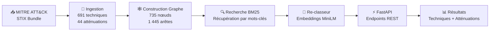
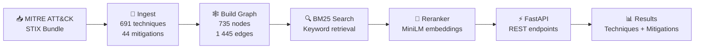

<div align="center">

🇫🇷 [Version française](#french) | 🇬🇧 [English version](#english)

</div>

---

<a name="french"></a>

# 🛡️ ATT&CK Ground Segment Threat Graph

[](https://github.com/thierrymaesen/attack-gseg/actions/workflows/ci.yml)
[](https://opensource.org/licenses/MIT)
[](https://www.python.org/downloads/)
[](https://github.com/psf/black)
[](https://colab.research.google.com/github/thierrymaesen/attack-gseg/blob/main/demo.ipynb)

> Un outil de sécurité propulsé par l’IA qui mappe les logs de segments sol vers les techniques MITRE ATT&CK en utilisant la recherche sémantique et les graphes de connaissances. Conçu pour les centres d’opérations de sécurité spatiale (SOC).

> ⚠️ **Note importante :** Ce projet fonctionne **uniquement en anglais**. Les requêtes, descriptions d’événements de sécurité et résultats sont en anglais, car il s’appuie sur la base de données MITRE ATT&CK qui est exclusivement en anglais.

### 🤖 Domaine IA & Approche

Ce projet appartient au domaine du **Traitement Automatique du Langage Naturel (NLP)** appliqué au **renseignement sur les menaces en cybersécurité**. Il implémente un **pipeline hybride augmenté par la recherche** qui combine la recherche d’information classique avec des techniques modernes de deep learning :

- **Recherche d’Information (BM25)** — Un algorithme de recherche probabiliste par mots-clés (Okapi BM25) indexe les 691 descriptions de techniques ATT&CK et effectue une correspondance lexicale rapide avec les requêtes d’événements de sécurité.
- **Recherche Sémantique (Sentence Embeddings)** — Un modèle transformer pré-entraîné (`all-MiniLM-L6-v2` de Hugging Face / sentence-transformers) encode la requête et les techniques candidates en représentations vectorielles denses (embeddings de 384 dimensions), puis re-classe les résultats par similarité cosinus pour capturer le sens au-delà de la correspondance exacte de mots-clés.
- **Raisonnement par Graphe de Connaissances (NetworkX)** — Un graphe orienté modélise les relations structurées entre les techniques ATT&CK et les mesures d’atténuation (735 nœuds, 1 445 arêtes), permettant au système de parcourir les liens et de recommander des mesures défensives pour chaque menace identifiée.

L’approche IA est **recherche + re-classement** (parfois appelée *pipeline de recherche à deux étapes*) : BM25 récupère un large ensemble de candidats pertinents par mots-clés, puis le re-classeur neuronal affine le classement en utilisant la compréhension sémantique. Cette architecture n’utilise pas d’IA générative (aucun LLM ne génère de texte) ; elle s’appuie sur des **modèles NLP discriminatifs** pour le scoring de similarité et un **graphe de connaissances structuré** pour la navigation relationnelle.

### 📋 Ce que le programme peut faire aujourd’hui

ATT&CK Ground Segment Threat Graph est un outil d’analyse de sécurité pleinement opérationnel qui permet aux analystes de :

- **Mapper tout événement de sécurité vers les techniques MITRE ATT&CK** — Décrivez un incident en langage naturel (ex. : *"Unauthorized SSH access from unknown IP attempting lateral movement"*) et le système identifie les techniques ATT&CK les plus pertinentes classées par score de confiance.
- **Obtenir des recommandations d’atténuation exploitables** — Pour chaque technique identifiée, le graphe de connaissances fournit les mesures d’atténuation officielles MITRE avec des liens directs vers le site ATT&CK.
- **Interroger via API REST ou interface web** — Utilisez les endpoints FastAPI (`/map_event`, `/techniques`, `/health`) pour une intégration programmatique, ou l’interface interactive Gradio pour l’analyse et le triage manuels.
- **Analyser les événements en quasi temps réel** — Le pipeline complet (recherche BM25 + re-classement sémantique + parcours du graphe) s’exécute en environ 200 ms, adapté aux workflows d’opérations de sécurité en temps réel.
- **Couvrir l’intégralité de la matrice ATT&CK Enterprise** — Le système indexe 691 techniques (216 de base + 475 sous-techniques) et 44 mesures d’atténuation à partir des données STIX officielles MITRE ATT&CK, assurant une couverture complète des menaces.

**Auteur :** [Thierry Maesen](https://github.com/thierrymaesen)
**Dépôt :** [github.com/thierrymaesen/attack-gseg](https://github.com/thierrymaesen/attack-gseg)

---

## 🎬 Démo — Pipeline en Action

Cliquez sur le badge **Open in Colab** ci-dessus pour exécuter le pipeline complet de manière interactive — aucune installation requise.
Voici un parcours de chaque étape avec les sorties réelles.

### Vue d’ensemble du Pipeline



### Étape 1 — Ingestion des données ATT&CK STIX

Le pipeline télécharge le [bundle STIX officiel MITRE ATT&CK Enterprise](https://github.com/mitre/cti) (43 Mo) et le parse en fichiers JSON structurés. Les chiffres correspondent exactement à la base officielle MITRE ATT&CK : **691 techniques** (216 + 475 sous-techniques), **44 mesures d’atténuation**, et **1 445 relations**.


### Étape 2 — Construction du Graphe de Connaissances

Un graphe orienté NetworkX est construit avec **735 nœuds** (691 techniques + 44 atténuations) et **1 445 arêtes** (relations atténuation→technique). Les statistiques révèlent que `defense-evasion` est la tactique la plus représentée (215 techniques), et que 84,2 % des techniques ont au moins une atténuation documentée.


### Étape 3 — Recherche par mots-clés BM25

Un index BM25 sur les descriptions de techniques permet une recherche rapide par mots-clés. Pour la requête `"SSH lateral movement"`, le moteur retourne correctement **T1570 — Lateral Tool Transfer** comme premier résultat, suivi des techniques liées à SSH et leurs atténuations.


### Étape 4 — Re-classement Sémantique

Les candidats BM25 sont re-classés en utilisant les embeddings de phrases `all-MiniLM-L6-v2` pour la pertinence sémantique. Pour `"process injection to evade detection"`, le re-classeur place **T1055 — Process Injection** en #1 (score 0.5990) et promeut T1564.011 du rang BM25 17 au rang 2, démontrant la valeur de la compréhension sémantique par rapport à la simple correspondance de mots-clés.


### Étape 5 — FastAPI + Requête en Direct

Le serveur FastAPI expose les endpoints `/map_event`, `/techniques` et `/health`. Une requête pour `"phishing email with malicious attachment"` retourne **T1566 — Phishing** comme premier résultat avec ses atténuations officielles MITRE (Antivirus/Antimalware, Audit, Network Intrusion Prevention) — tous vérifiés sur le [site MITRE ATT&CK](https://attack.mitre.org/techniques/T1566/).


---

## ✨ Fonctionnalités

- 🧠 **Recherche Sémantique** — Combine la recherche BM25 avec les embeddings de phrases `all-MiniLM-L6-v2` pour une détection de techniques contextuelle.
- 🕸️ **Graphe de Connaissances** — Navigue les relations entre les techniques ATT&CK et les mesures d’atténuation via un graphe orienté NetworkX.
- ⚡ **Backend FastAPI** — API REST haute performance avec documentation Swagger/OpenAPI automatique.
- 🖥️ **Interface Gradio** — Interface web interactive pour que les analystes de sécurité puissent trier les événements en temps réel.
- 🏗️ **Prêt pour la Production** — Entièrement testé (pytest + coverage), linté (Ruff), formaté (Black), et intégré CI/CD (GitHub Actions).

---

## 🚀 Démarrage Rapide

### Prérequis

- **Python 3.10+** — [Télécharger](https://www.python.org/downloads/)
- **Poetry** (recommandé) — [Installer Poetry](https://python-poetry.org/docs/#installation)

> **Pas de Poetry ?** Vous pouvez utiliser `pip` à la place — voir l’alternative **pip** dans chaque étape ci-dessous.

### 1. Cloner & Installer

**Avec Poetry (recommandé) :**

```bash
git clone https://github.com/thierrymaesen/attack-gseg.git
cd attack-gseg
poetry install
```

**Avec pip :**

```bash
git clone https://github.com/thierrymaesen/attack-gseg.git
cd attack-gseg
pip install -e .
```

### 2. Ingérer les données ATT&CK (première exécution uniquement)

**Avec Poetry :**

```bash
# Download MITRE ATT&CK STIX bundle and build the knowledge graph
poetry run python -m gseg.ingest_attack
poetry run python -m gseg.build_graph
```

**Avec pip :**

```bash
# Download MITRE ATT&CK STIX bundle and build the knowledge graph
python -m gseg.ingest_attack
python -m gseg.build_graph
```

### 3. Lancer l’Application

**Avec Poetry :**

```bash
# Terminal 1 — Start the API server
poetry run uvicorn gseg.api:app --reload

# Terminal 2 — Start the Gradio UI
poetry run python app/gradio_app.py
```

**Avec pip :**

```bash
# Terminal 1 — Start the API server
uvicorn gseg.api:app --reload

# Terminal 2 — Start the Gradio UI
python app/gradio_app.py
```

L’API est disponible à **http://localhost:8000** et l’interface Gradio à **http://localhost:7860**.

### 🖥️ Guide d’utilisation locale — Étape par Étape

Une fois les deux serveurs démarrés, voici comment utiliser l’application localement sur votre ordinateur.

#### Étape 1 — Vérifier que l’API fonctionne

Ouvrez votre navigateur et accédez à `http://localhost:8000/health`. Vous devriez voir la réponse JSON suivante confirmant que l’API est opérationnelle et que tous les modèles sont chargés :


> **Note :** Si vous visitez directement `http://localhost:8000`, vous verrez `{"detail":"Not Found"}` — c’est **normal**. L’API n’a pas de page d’accueil ; elle répond uniquement sur ses endpoints spécifiques (`/health`, `/map_event`, `/techniques`).
>
> #### Étape 2 — Explorer la documentation API (Swagger UI)
>
> Accédez à `http://localhost:8000/docs` pour consulter la documentation interactive Swagger. Vous pouvez y voir tous les endpoints disponibles, les tester directement depuis le navigateur, et inspecter les schémas de requête/réponse :
>
> 
>
> L’API expose trois endpoints : `GET /health` (vérification de santé du service), `POST /map_event` (mapper un événement de sécurité vers les techniques ATT&CK), et `GET /techniques` (lister toutes les techniques indexées).
>
> #### Étape 3 — Ouvrir l’interface Gradio
>
> Accédez à `http://localhost:7860` dans votre navigateur. L’interface web Gradio se charge avec une zone de texte où vous pouvez décrire un événement de sécurité, un curseur pour choisir le nombre de résultats à afficher (Top K), et une case à cocher pour inclure les atténuations :
>
> 
>
> #### Étape 4 — Saisir une description d’événement de sécurité
>
> Tapez ou collez une description d’événement de sécurité dans la zone de texte. Par exemple : *"Unauthorized SSH access from unknown IP attempting lateral movement to ground station controller"*. Ajustez le curseur **Top K Results** si nécessaire (défaut : 3), puis cliquez sur le bouton **Analyze Threat** :
>
> 
>
> #### Étape 5 — Consulter les résultats d’analyse
>
> Après avoir cliqué sur **Analyze Threat**, le système retourne les techniques MITRE ATT&CK les plus correspondantes, classées par pertinence. Chaque résultat inclut l’identifiant de la technique (lié au site MITRE), le nom de la technique, les scores BM25 et de re-classement, les tactiques associées et les atténuations recommandées :
>
> 
>
> Faites défiler vers le bas pour voir les techniques supplémentaires. Dans cet exemple, le système a identifié trois techniques pertinentes : **T1563.001 — SSH Hijacking**, **T1021.004 — SSH**, et **T1098.004 — SSH Authorized Keys**, chacune avec leurs tactiques et atténuations associées :
>
> 
>
> > **Astuce :** Cliquez sur n’importe quel identifiant de technique (ex. T1563.001) ou d’atténuation (ex. M1042) pour ouvrir la page correspondante sur le site officiel MITRE ATT&CK.

### ☁️ Google Colab (aucune installation requise)

Cliquez sur le badge ci-dessous pour exécuter le pipeline complet dans votre navigateur :

[](https://colab.research.google.com/github/thierrymaesen/attack-gseg/blob/main/demo.ipynb)

Le notebook utilise `pip install -e .` en interne — Poetry n’est pas nécessaire sur Colab.

---

## 🏗️ Architecture

```text
ATT&CK Ground Segment Threat Graph
==================================

+-----------+    +-------------+    +---------------------+    +------------------+
| Security  |    |   FastAPI    |    | Retrieval Engine    |    | Knowledge Graph  |
|   Logs    |--->|  /map_event  |--->| BM25 + Reranker     |--->|   (NetworkX)     |
| (events)  |    |   REST API   |    | (MiniLM embeddings) |    |                  |
+-----------+    +-------------+    +---------------------+    +------------------+
                       |                                             |
                       v                                             v
                 +----------+                               +----------------+
                 | Gradio UI|                               |  Techniques    |
                 | (analysts|                               |  Mitigations   |
                 |  triage) |                               |  Relationships |
                 +----------+                               +----------------+
```

**Flux de données :**

1. **Ingestion** — Télécharge le bundle STIX MITRE ATT&CK et parse les techniques, atténuations et relations ([src/gseg/ingest_attack.py](src/gseg/ingest_attack.py)).
2. **Construction du Graphe** — Construit un graphe de connaissances orienté avec les nœuds techniques et atténuations ([src/gseg/build_graph.py](src/gseg/build_graph.py)).
3. **Recherche** — Recherche par mots-clés BM25 sur les descriptions de techniques ([src/gseg/retrieve.py](src/gseg/retrieve.py)).
4. **Re-classement** — Re-classement sémantique avec des embeddings sentence-transformer ([src/gseg/rank.py](src/gseg/rank.py)).
5. **Service** — FastAPI expose les endpoints `/map_event`, `/techniques`, et `/health` ([src/gseg/api.py](src/gseg/api.py)).
6. **Visualisation** — Gradio fournit une interface interactive pour les analystes ([app/gradio_app.py](app/gradio_app.py)).

---

## 📖 Documentation API

Une fois le serveur API démarré, la documentation interactive est disponible à :

| Docs | URL |
|------|-----|
| Swagger UI | [http://localhost:8000/docs](http://localhost:8000/docs) |
| ReDoc | [http://localhost:8000/redoc](http://localhost:8000/redoc) |

### Endpoints Principaux

| Méthode | Endpoint | Description |
|---------|----------|-------------|
| `GET`  | `/health` | Vérification de santé du service |
| `POST` | `/map_event` | Mapper un événement de sécurité vers les techniques ATT&CK classées |
| `GET`  | `/techniques` | Liste paginée de toutes les techniques indexées |

### Exemple de Requête

```bash
curl -X POST http://localhost:8000/map_event \
  -H "Content-Type: application/json" \
  -d '{"text": "Detected SSH lateral movement to 10.0.0.5", "top_k": 5}'
```

---

## 🧪 Tests

**Avec Poetry :**

```bash
# Run all tests with coverage report
poetry run pytest tests/ -v --cov=src --cov-report=term-missing

# Run linting
poetry run ruff check src/ tests/

# Check formatting
poetry run black --check src/ tests/
```

**Avec pip :**

```bash
# Install dev dependencies first
pip install pytest pytest-cov ruff black

# Run all tests with coverage report
pytest tests/ -v --cov=src --cov-report=term-missing

# Run linting
ruff check src/ tests/

# Check formatting
black --check src/ tests/
```

Les tests couvrent l’ingestion des données, la construction du graphe, la recherche BM25, le re-classement sémantique et tous les endpoints FastAPI.

---

## 📁 Structure du Projet

```text
attack-gseg/
├── .github/workflows/ci.yml   # Pipeline CI GitHub Actions
├── app/
│   └── gradio_app.py           # Interface web Gradio
├── src/gseg/
│   ├── __init__.py             # Métadonnées du package
│   ├── ingest_attack.py        # Ingestion des données STIX
│   ├── build_graph.py          # Construction du graphe de connaissances
│   ├── retrieve.py             # Moteur de recherche BM25
│   ├── rank.py                 # Re-classement sémantique
│   └── api.py                  # API REST FastAPI
├── tests/
│   ├── test_ingest.py          # Tests d’ingestion
│   ├── test_graph.py           # Tests de construction du graphe
│   ├── test_retrieve.py        # Tests de recherche
│   ├── test_rank.py            # Tests de re-classement
│   └── test_api.py             # Tests des endpoints API
├── demo.ipynb                  # Démo interactive Colab
├── pyproject.toml              # Configuration du projet Poetry
└── README.md                   # Ce fichier
```

---

## 📊 État du Développement

**Progression des Sprints :** 11/11 terminés

- [x] Sprint 0 — Mise en place du projet
- [x] Sprint 1 — Ingestion des données (ATT&CK STIX)
- [x] Sprint 2 — Construction du graphe (NetworkX)
- [x] Sprint 3 — Moteur de recherche (BM25)
- [x] Sprint 4 — Re-classement (embeddings)
- [x] Sprint 5 — API (FastAPI)
- [x] Sprint 6 — Interface (Gradio)
- [x] Sprint 7 — Tests (pytest)
- [x] Sprint 8 — Évaluation
- [x] Sprint 9 — CI/CD (GitHub Actions)
- [x] Sprint 10 — Documentation

---

## 🗺️ Feuille de Route

- [ ] Ajouter des embeddings de graphe (Node2Vec) pour améliorer la prédiction de liens et la similarité entre techniques.
- [ ] Supporter l’ingestion de logs en streaming via Kafka ou NATS pour la surveillance en temps réel.
- [ ] Déployer sur Hugging Face Spaces avec un runtime basé sur Docker.
- [ ] Intégrer les sous-techniques MITRE ATT&CK pour un mapping plus fin.
- [ ] Ajouter le support des flux STIX/TAXII pour les mises à jour automatisées de renseignement sur les menaces.

---

## 🤝 Contribuer

Les pull requests sont les bienvenues. Veuillez d’abord ouvrir une issue pour discuter de ce que vous souhaitez modifier.

1. Forkez le dépôt.
2. Créez une branche fonctionnalité (`git checkout -b feature/ma-fonctionnalite`).
3. Committez vos changements (`git commit -m "Ajout de ma fonctionnalité"`).
4. Poussez sur la branche (`git push origin feature/ma-fonctionnalite`).
5. Ouvrez une pull request.

Veuillez vous assurer que tous les tests passent et que le code suit le style du projet (Black + Ruff) avant de soumettre.

---

## 📜 Licence

Ce projet est sous licence [MIT License](https://opensource.org/licenses/MIT).

Les données ATT&CK sont fournies par [MITRE ATT&CK®](https://attack.mitre.org/). MITRE ATT&CK est une marque déposée de The MITRE Corporation.

---

---

<a name="english"></a>

# 🛡️ ATT&CK Ground Segment Threat Graph

[](https://github.com/thierrymaesen/attack-gseg/actions/workflows/ci.yml)
[](https://opensource.org/licenses/MIT)
[](https://www.python.org/downloads/)
[](https://github.com/psf/black)
[](https://colab.research.google.com/github/thierrymaesen/attack-gseg/blob/main/demo.ipynb)

> An AI-powered security tool that maps ground segment logs to MITRE ATT&CK techniques using semantic search and knowledge graphs. Designed for space operations centers (SOC).

> ⚠️ **Important note:** This project works **in English only**. Queries, security event descriptions and results are in English, as it relies on the MITRE ATT&CK database which is exclusively in English.

### 🤖 AI Domain & Approach

This project belongs to the field of **Natural Language Processing (NLP)** applied to **cybersecurity threat intelligence**. It implements a **hybrid retrieval-augmented pipeline** that combines classical information retrieval with modern deep learning techniques:

- **Information Retrieval (BM25)** — A probabilistic keyword-based search algorithm (Okapi BM25) indexes all 691 ATT&CK technique descriptions and performs fast lexical matching against security event queries.
- **Semantic Search (Sentence Embeddings)** — A pre-trained transformer model (`all-MiniLM-L6-v2` from Hugging Face / sentence-transformers) encodes both the query and candidate techniques into dense vector representations (384-dimensional embeddings), then reranks results by cosine similarity to capture meaning beyond exact keyword matches.
- **Knowledge Graph Reasoning (NetworkX)** — A directed graph models the structured relationships between ATT&CK techniques and mitigations (735 nodes, 1 445 edges), enabling the system to traverse links and recommend defensive measures for each identified threat.

The AI approach is **retrieval + reranking** (sometimes called a *two-stage retrieval pipeline*): BM25 retrieves a broad set of keyword-relevant candidates, then the neural reranker refines the ranking using semantic understanding. This architecture does not use generative AI (no LLM generates text); instead, it relies on **discriminative NLP models** for similarity scoring and a **structured knowledge graph** for relationship navigation.

### 📋 What the Program Can Do Today

ATT&CK Ground Segment Threat Graph is a fully operational security analysis tool that enables analysts to:

- **Map any security event to MITRE ATT&CK techniques** — Describe an incident in plain language (e.g., *"Unauthorized SSH access from unknown IP attempting lateral movement"*) and the system identifies the most relevant ATT&CK techniques ranked by confidence score.
- **Get actionable mitigation recommendations** — For each identified technique, the knowledge graph provides the officially documented MITRE mitigations with direct links to the ATT&CK website.
- **Query via REST API or web interface** — Use the FastAPI endpoints (`/map_event`, `/techniques`, `/health`) for programmatic integration, or the interactive Gradio UI for manual analysis and triage.
- **Analyze events in near real-time** — The full pipeline (BM25 retrieval + semantic reranking + graph traversal) completes in approximately 200 ms, making it suitable for real-time security operations workflows.
- **Cover the full ATT&CK Enterprise matrix** — The system indexes 691 techniques (216 base + 475 sub-techniques) and 44 mitigations from the official MITRE ATT&CK STIX data, ensuring comprehensive threat coverage.

**Author:** [Thierry Maesen](https://github.com/thierrymaesen)
**Repository:** [github.com/thierrymaesen/attack-gseg](https://github.com/thierrymaesen/attack-gseg)

---

## 🎬 Demo — Pipeline in Action

Click the **Open in Colab** badge above to run the full pipeline interactively — no install required.
Below is a walkthrough of each stage with real output.

### Pipeline Overview



### Step 1 — Ingest ATT&CK STIX Data

The pipeline downloads the official [MITRE ATT&CK Enterprise STIX bundle](https://github.com/mitre/cti) (43 MB) and parses it into structured JSON files. The counts match the official MITRE ATT&CK database exactly: **691 techniques** (216 + 475 sub-techniques), **44 mitigations**, and **1 445 relationships**.


### Step 2 — Build Knowledge Graph

A directed NetworkX graph is constructed with **735 nodes** (691 techniques + 44 mitigations) and **1 445 edges** (mitigation→technique relationships). The statistics reveal that `defense-evasion` is the most represented tactic (215 techniques), and 84.2% of techniques have at least one documented mitigation.


### Step 3 — BM25 Keyword Retrieval

A BM25 index over technique descriptions enables fast keyword search. For the query `"SSH lateral movement"`, the engine correctly returns **T1570 — Lateral Tool Transfer** as the top match, followed by SSH-related techniques and their mitigations.


### Step 4 — Semantic Reranking

BM25 candidates are reranked using `all-MiniLM-L6-v2` sentence embeddings for semantic relevance. For `"process injection to evade detection"`, the reranker places **T1055 — Process Injection** at #1 (score 0.5990) and promotes T1564.011 from BM25 rank 17 to rank 2, demonstrating the value of semantic understanding over pure keyword matching.


### Step 5 — FastAPI + Live Query

The FastAPI server exposes `/map_event`, `/techniques`, and `/health` endpoints. A query for `"phishing email with malicious attachment"` returns **T1566 — Phishing** as the top result with its official MITRE mitigations (Antivirus/Antimalware, Audit, Network Intrusion Prevention) — all verified against the [MITRE ATT&CK website](https://attack.mitre.org/techniques/T1566/).


---

## ✨ Features

- 🧠 **Semantic Search** — Combines BM25 retrieval with `all-MiniLM-L6-v2` sentence embeddings for context-aware technique detection.
- 🕸️ **Knowledge Graph** — Navigates relationships between ATT&CK Techniques and Mitigations via a directed NetworkX graph.
- ⚡ **FastAPI Backend** — High-performance REST API with automatic Swagger/OpenAPI documentation.
- 🖥️ **Gradio UI** — Interactive web interface for security analysts to triage events in real time.
- 🏗️ **Production-Ready** — Fully tested (pytest + coverage), linted (Ruff), formatted (Black), and CI/CD integrated (GitHub Actions).

---

## 🚀 Quickstart

### Prerequisites

- **Python 3.10+** — [Download](https://www.python.org/downloads/)
- **Poetry** (recommended) — [Install Poetry](https://python-poetry.org/docs/#installation)

> **No Poetry?** You can use `pip` instead — see the **pip** alternative in each step below.

### 1. Clone & Install

**With Poetry (recommended):**

```bash
git clone https://github.com/thierrymaesen/attack-gseg.git
cd attack-gseg
poetry install
```

**With pip:**

```bash
git clone https://github.com/thierrymaesen/attack-gseg.git
cd attack-gseg
pip install -e .
```

### 2. Ingest ATT&CK Data (first run only)

**With Poetry:**

```bash
# Download MITRE ATT&CK STIX bundle and build the knowledge graph
poetry run python -m gseg.ingest_attack
poetry run python -m gseg.build_graph
```

**With pip:**

```bash
# Download MITRE ATT&CK STIX bundle and build the knowledge graph
python -m gseg.ingest_attack
python -m gseg.build_graph
```

### 3. Run the Application

**With Poetry:**

```bash
# Terminal 1 — Start the API server
poetry run uvicorn gseg.api:app --reload

# Terminal 2 — Start the Gradio UI
poetry run python app/gradio_app.py
```

**With pip:**

```bash
# Terminal 1 — Start the API server
uvicorn gseg.api:app --reload

# Terminal 2 — Start the Gradio UI
python app/gradio_app.py
```

The API is available at **http://localhost:8000** and the Gradio UI at **http://localhost:7860**.

### 🖥️ Local Usage Guide — Step by Step

Once both servers are running, here is how to use the application locally on your computer.

#### Step 1 — Verify the API is running

Open your browser and navigate to `http://localhost:8000/health`. You should see the following JSON response confirming the API is operational and all models are loaded:


> **Note:** If you visit `http://localhost:8000` directly, you will see `{"detail":"Not Found"}` — this is **normal**. The API has no homepage; it only responds on its specific endpoints (`/health`, `/map_event`, `/techniques`).
>
> #### Step 2 — Explore the API documentation (Swagger UI)
>
> Navigate to `http://localhost:8000/docs` to access the interactive Swagger documentation. Here you can see all available endpoints, test them directly from the browser, and inspect request/response schemas:
>
> 
>
> The API exposes three endpoints: `GET /health` (service health check), `POST /map_event` (map a security event to ATT&CK techniques), and `GET /techniques` (list all indexed techniques).
>
> #### Step 3 — Open the Gradio interface
>
> Navigate to `http://localhost:7860` in your browser. The Gradio web interface loads with a text area where you can describe a security event, a slider to choose how many results to display (Top K), and a checkbox to include mitigations:
>
> 
>
> #### Step 4 — Enter a security event description
>
> Type or paste a security event description in the text area. For example: *"Unauthorized SSH access from unknown IP attempting lateral movement to ground station controller"*. Adjust the **Top K Results** slider if needed (default is 3), then click the **Analyze Threat** button:
>
> 
>
> #### Step 5 — Review the analysis results
>
> After clicking **Analyze Threat**, the system returns the top matching MITRE ATT&CK techniques ranked by relevance. Each result includes the technique ID (linked to MITRE), the technique name, BM25 and rerank scores, associated tactics, and recommended mitigations:
>
> 
>
> Scroll down to see additional matching techniques. In this example, the system identified three relevant techniques: **T1563.001 — SSH Hijacking**, **T1021.004 — SSH**, and **T1098.004 — SSH Authorized Keys**, each with their associated tactics and mitigations:
>
> 
>
> > **Tip:** Click on any technique ID (e.g., T1563.001) or mitigation ID (e.g., M1042) to open the corresponding page on the official MITRE ATT&CK website for more details.

### ☁️ Google Colab (no install required)

Click the badge below to run the full pipeline in your browser:

[](https://colab.research.google.com/github/thierrymaesen/attack-gseg/blob/main/demo.ipynb)

The notebook uses `pip install -e .` under the hood — Poetry is not needed on Colab.

---

## 🏗️ Architecture

```text
ATT&CK Ground Segment Threat Graph
==================================

+-----------+    +-------------+    +---------------------+    +------------------+
| Security  |    |   FastAPI    |    | Retrieval Engine    |    | Knowledge Graph  |
|   Logs    |--->|  /map_event  |--->| BM25 + Reranker     |--->|   (NetworkX)     |
| (events)  |    |   REST API   |    | (MiniLM embeddings) |    |                  |
+-----------+    +-------------+    +---------------------+    +------------------+
                       |                                             |
                       v                                             v
                 +----------+                               +----------------+
                 | Gradio UI|                               |  Techniques    |
                 | (analysts|                               |  Mitigations   |
                 |  triage) |                               |  Relationships |
                 +----------+                               +----------------+
```

**Data flow:**

1. **Ingest** — Downloads the MITRE ATT&CK STIX bundle and parses techniques, mitigations, and relationships ([src/gseg/ingest_attack.py](src/gseg/ingest_attack.py)).
2. **Build Graph** — Constructs a directed knowledge graph with technique and mitigation nodes ([src/gseg/build_graph.py](src/gseg/build_graph.py)).
3. **Retrieve** — BM25 keyword search over technique descriptions ([src/gseg/retrieve.py](src/gseg/retrieve.py)).
4. **Rerank** — Semantic reranking with sentence-transformer embeddings ([src/gseg/rank.py](src/gseg/rank.py)).
5. **Serve** — FastAPI exposes `/map_event`, `/techniques`, and `/health` endpoints ([src/gseg/api.py](src/gseg/api.py)).
6. **Visualise** — Gradio provides an interactive analyst interface ([app/gradio_app.py](app/gradio_app.py)).

---

## 📖 API Documentation

Once the API server is running, interactive documentation is available at:

| Docs | URL |
|------|-----|
| Swagger UI | [http://localhost:8000/docs](http://localhost:8000/docs) |
| ReDoc | [http://localhost:8000/redoc](http://localhost:8000/redoc) |

### Key Endpoints

| Method | Endpoint | Description |
|--------|----------|-------------|
| `GET`  | `/health` | Service health check |
| `POST` | `/map_event` | Map a security event to ranked ATT&CK techniques |
| `GET`  | `/techniques` | Paginated list of all indexed techniques |

### Example Request

```bash
curl -X POST http://localhost:8000/map_event \
  -H "Content-Type: application/json" \
  -d '{"text": "Detected SSH lateral movement to 10.0.0.5", "top_k": 5}'
```

---

## 🧪 Testing

**With Poetry:**

```bash
# Run all tests with coverage report
poetry run pytest tests/ -v --cov=src --cov-report=term-missing

# Run linting
poetry run ruff check src/ tests/

# Check formatting
poetry run black --check src/ tests/
```

**With pip:**

```bash
# Install dev dependencies first
pip install pytest pytest-cov ruff black

# Run all tests with coverage report
pytest tests/ -v --cov=src --cov-report=term-missing

# Run linting
ruff check src/ tests/

# Check formatting
black --check src/ tests/
```

Tests cover data ingestion, graph building, BM25 retrieval, semantic reranking, and all FastAPI endpoints.

---

## 📁 Project Structure

```text
attack-gseg/
├── .github/workflows/ci.yml   # GitHub Actions CI pipeline
├── app/
│   └── gradio_app.py           # Gradio web interface
├── src/gseg/
│   ├── __init__.py             # Package metadata
│   ├── ingest_attack.py        # STIX data ingestion
│   ├── build_graph.py          # Knowledge graph construction
│   ├── retrieve.py             # BM25 retrieval engine
│   ├── rank.py                 # Semantic reranking
│   └── api.py                  # FastAPI REST API
├── tests/
│   ├── test_ingest.py          # Ingestion tests
│   ├── test_graph.py           # Graph building tests
│   ├── test_retrieve.py        # Retrieval tests
│   ├── test_rank.py            # Reranking tests
│   └── test_api.py             # API endpoint tests
├── demo.ipynb                  # Interactive Colab demo
├── pyproject.toml              # Poetry project config
└── README.md                   # This file
```

---

## 📊 Development Status

**Sprint Progress:** 11/11 completed

- [x] Sprint 0 — Project setup
- [x] Sprint 1 — Data ingestion (ATT&CK STIX)
- [x] Sprint 2 — Graph building (NetworkX)
- [x] Sprint 3 — Retrieval engine (BM25)
- [x] Sprint 4 — Reranking (embeddings)
- [x] Sprint 5 — API (FastAPI)
- [x] Sprint 6 — UI (Gradio)
- [x] Sprint 7 — Tests (pytest)
- [x] Sprint 8 — Evaluation
- [x] Sprint 9 — CI/CD (GitHub Actions)
- [x] Sprint 10 — Documentation

---

## 🗺️ Roadmap

- [ ] Add graph embeddings (Node2Vec) for improved link prediction and technique similarity.
- [ ] Support streaming log ingestion via Kafka or NATS for real-time monitoring.
- [ ] Deploy to Hugging Face Spaces with a Docker-based runtime.
- [ ] Integrate MITRE ATT&CK sub-techniques for finer-grained mapping.
- [ ] Add STIX/TAXII feed support for automated threat intelligence updates.

---

## 🤝 Contributing

Pull requests are welcome. Please open an issue first to discuss what you would like to change.

1. Fork the repository.
2. Create a feature branch (`git checkout -b feature/my-feature`).
3. Commit your changes (`git commit -m "Add my feature"`).
4. Push to the branch (`git push origin feature/my-feature`).
5. Open a pull request.

Please ensure all tests pass and code follows the project style (Black + Ruff) before submitting.

---

## 📜 License

This project is licensed under the [MIT License](https://opensource.org/licenses/MIT).

ATT&CK data provided by [MITRE ATT&CK®](https://attack.mitre.org/). MITRE ATT&CK is a registered trademark of The MITRE Corporation.
