# 🛡️ ATT&CK Ground Segment Threat Graph

> An AI-powered security tool that maps ground segment logs to MITRE ATT&CK techniques using semantic search and knowledge graphs. Designed for space operations centers (SOC).

### 🤖 AI Domain & Approach

This project belongs to the field of **Natural Language Processing (NLP)** applied to **cybersecurity threat intelligence**. It implements a **hybrid retrieval-augmented pipeline** that combines classical information retrieval with modern deep learning techniques:

- **Information Retrieval (BM25)** — A probabilistic keyword-based search algorithm (Okapi BM25) indexes all 691 ATT&CK technique descriptions and performs fast lexical matching against security event queries.
- **Semantic Search (Sentence Embeddings)** — A pre-trained transformer model (`all-MiniLM-L6-v2` from Hugging Face / sentence-transformers) encodes both the query and candidate techniques into dense vector representations (384-dimensional embeddings), then reranks results by cosine similarity to capture meaning beyond exact keyword matches.
- **Knowledge Graph Reasoning (NetworkX)** — A directed graph models the structured relationships between ATT&CK techniques and mitigations (735 nodes, 1 445 edges), enabling the system to traverse links and recommend defensive measures for each identified threat.

The AI approach is **retrieval + reranking** (sometimes called a *two-stage retrieval pipeline*): BM25 retrieves a broad set of keyword-relevant candidates, then the neural reranker refines the ranking using semantic understanding. This architecture does not use generative AI (no LLM generates text); instead, it relies on **discriminative NLP models** for similarity scoring and a **structured knowledge graph** for relationship navigation.

### 📋 What the Program Can Do Today

ATT&CK Ground Segment Threat Graph is a fully operational security analysis tool that enables analysts to:

- **Map any security event to MITRE ATT&CK techniques** — Describe an incident in plain language (e.g., *"Unauthorized SSH access from unknown IP attempting lateral movement"*) and the system identifies the most relevant ATT&CK techniques ranked by confidence score.
- **Get actionable mitigation recommendations** — For each identified technique, the knowledge graph provides the officially documented MITRE mitigations with direct links to the ATT&CK website.
- **Query via REST API or web interface** — Use the FastAPI endpoints (`/map_event`, `/techniques`, `/health`) for programmatic integration, or the interactive Gradio UI for manual analysis and triage.
- **Analyze events in near real-time** — The full pipeline (BM25 retrieval + semantic reranking + graph traversal) completes in approximately 200 ms, making it suitable for real-time security operations workflows.
- **Cover the full ATT&CK Enterprise matrix** — The system indexes 691 techniques (216 base + 475 sub-techniques) and 44 mitigations from the official MITRE ATT&CK STIX data, ensuring comprehensive threat coverage.

**Author:** [Thierry Maesen](https://github.com/thierrymaesen)
**Repository:** [github.com/thierrymaesen/attack-gseg](https://github.com/thierrymaesen/attack-gseg)

---

## 🎬 Demo — Pipeline in Action

Click the **Open in Colab** badge above to run the full pipeline interactively — no install required. Below is a walkthrough of each stage with real output.

### Pipeline Overview

```mermaid
flowchart LR
    A[📥 MITRE ATT&CK\nSTIX Bundle] --> B[🔄 Ingest\n691 techniques\n44 mitigations]
    B --> C[🕸️ Build Graph\n735 nodes\n1 445 edges]
    C --> D[🔍 BM25 Search\nKeyword retrieval]
    D --> E[🧠 Reranker\nMiniLM embeddings]
    E --> F[⚡ FastAPI\nREST endpoints]
    F --> G[📊 Results\nTechniques + Mitigations]
```

### Step 1 — Ingest ATT&CK STIX Data

The pipeline downloads the official [MITRE ATT&CK Enterprise STIX bundle](https://github.com/mitre/cti) (43 MB) and parses it into structured JSON files. The counts match the official MITRE ATT&CK database exactly: **691 techniques** (216 + 475 sub-techniques), **44 mitigations**, and **1 445 relationships**.

### Step 2 — Build Knowledge Graph

A directed NetworkX graph is constructed with **735 nodes** (691 techniques + 44 mitigations) and **1 445 edges** (mitigation→technique relationships). The statistics reveal that `defense-evasion` is the most represented tactic (215 techniques), and 84.2% of techniques have at least one documented mitigation.
